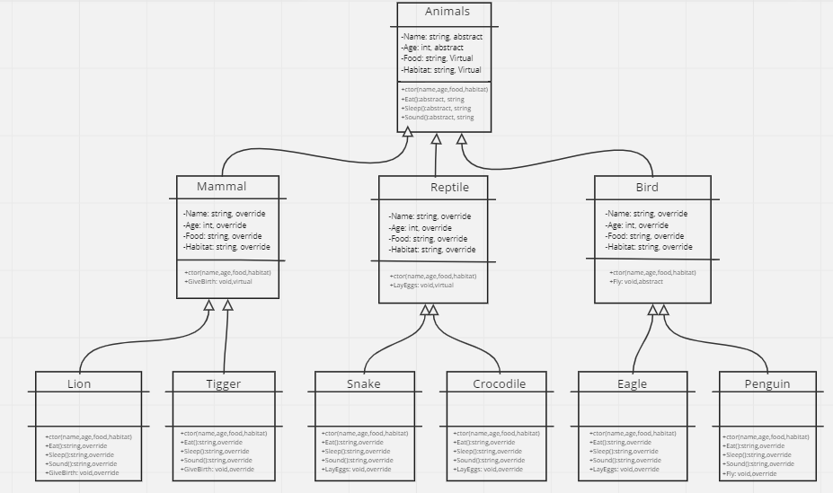
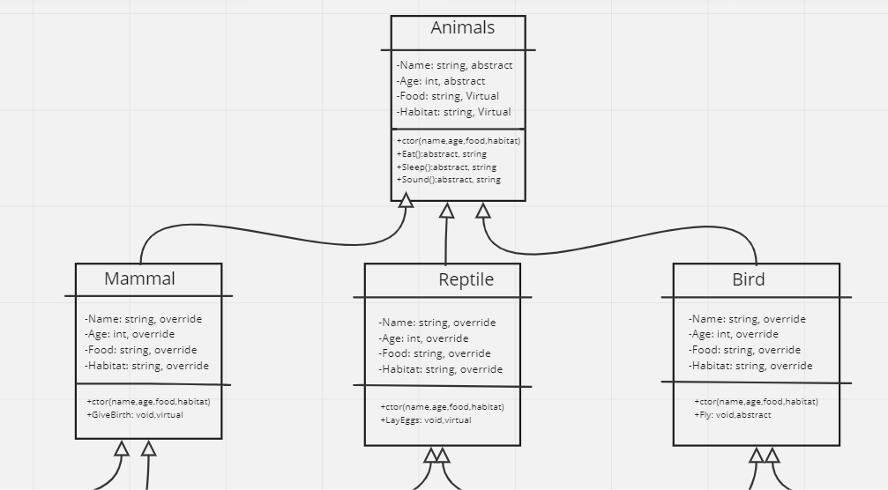
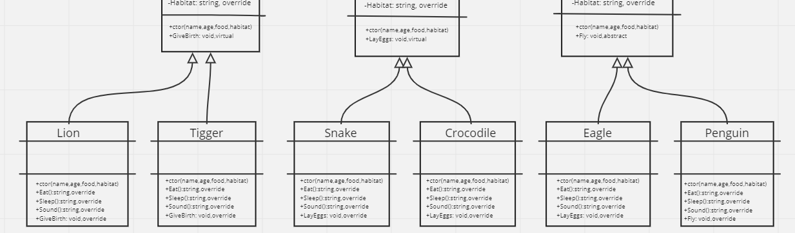
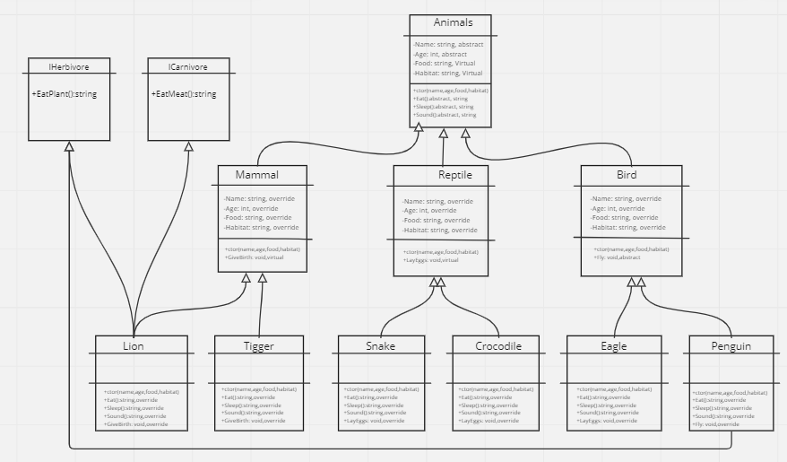

# Zoo Project

## Introduction

The Zoo Project is a console application that simulates a zoo environment. 
The project uses object-oriented programming principles to model different types of animals in the zoo and their behaviors. 
It demonstrates the use of inheritance, polymorphism, abstraction, and encapsulation to create a modular and extensible zoo system.

--- 

## Digital UML Drawing

Update UML and implement interfaces:

---

## OOP Principles

### Inheritance
Inheritance is a fundamental principle of object-oriented programming that allows classes to inherit properties and behaviors from their parent classes. In the Zoo Project, we have implemented inheritance in the animal hierarchy. For example, the Animal class serves as the base class for all animals in the zoo, and specific animal types such as Mammal, Reptile, Bird, etc., inherit from the Animal class. This allows us to define common attributes and methods in the base class and reuse them in the derived classes.

### Polymorphism
Polymorphism allows objects of different types to be treated as objects of a common base type. It allows for code reusability and flexibility. In the Zoo Project, we have utilized polymorphism by defining virtual and abstract methods in the base classes and overriding them in the derived classes. 

### Abstraction
Abstraction is the process of hiding unnecessary details and exposing only essential features of an object. It allows us to create abstract classes and methods that define a common interface without providing implementation details. In the Zoo Project, we have abstract classes such as Animal and Bird that provide a blueprint for the behavior of animals and birds, respectively. These abstract classes define abstract methods Fly(), which is implemented in the derived classes based on its specific behavior.

### Encapsulation
Encapsulation is a principle that combines data and methods into a single unit called a class, and provides access to the class members through well-defined interfaces. It promotes data hiding and protects the integrity of data. In the Zoo Project, we have encapsulated the data and methods within each animal class. For example, each animal class has private fields to store specific attributes and public methods to interact with and manipulate those attributes. The encapsulation ensures that the internal state of an animal is not directly accessible from outside the class, and all interactions occur through the defined methods.

---

## Examples of OOP Application in the Project
* Inheritance: The Lion class inherits from the Mammal class, which in turn inherits from the Animal class. This allows the Lion class to inherit properties and methods from both the Mammal and Animal classes.
* Polymorphism: The Mammal class defines a virtual method GiveBirth(), which is overridden in the Lion class to provide a specific behavior for lions.
* Abstraction: The Animal class is an abstract class that defines abstract methods such as Eat(). These methods provide a common interface for all animals in the zoo, but their implementation is left to the derived classes such as Lion and Snake.
* Encapsulation: Each animal class encapsulates its specific attributes and behaviors. For example, the Lion class has private fields for name and age, and public methods like SetAge() and GetName() to access and manipulate

---

## Interfaces
An interface is a programming construct that defines a contract for classes to follow. It specifies a set of methods and properties that a class implementing the interface must provide. Interfaces enable code reuse and allow objects of different classes to be treated uniformly based on shared behavior.

### ICarnivore
The ICarnivore interface defines the behavior of a carnivorous animal that eats meat. It includes a single method Eat().

Implemented by:

Lion class: Lions are carnivores, so they implement the ICarnivore interface to provide the specific implementation of the Eat() method.

### IHerbivore
The IHerbivore interface defines the behavior of a herbivorous animal that eats plants. It also includes a single method Eat().

Implemented by:

Penguin class: Penguins are herbivores, so they implement the IHerbivore interface to provide the specific implementation of the Eat() method.
